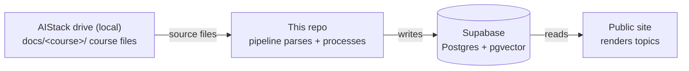

# The Library of Vincandria

A pipeline with multiple agents that turns raw course materials into a structured, publicly browsable knowledge graph. The first stage parses and chunks source files locally. Then 4 agents that use APIs extract concepts, map prerequisite relationships, enrich sparse topics, and generate teaching content. The result renders as a learning website where every topic links to its prerequisites and retains source grounding metadata for validation and review.

**Built with** Next.js, Prisma, Supabase (Postgres + pgvector), Python, Ollama, Claude API, and Voyage embeddings. No fine tuning.

---

## Current

| Metric                     | Value                                                                           |
| -------------------------- | ------------------------------------------------------------------------------- |
| Courses processed          | 3 (Multivariable Calculus, Numerical Computation, Data Structures & Algorithms) |
| Topics extracted           | 81                                                                              |
| Teaching blocks generated  | ~3,900                                                                          |
| Prerequisite edges         | 187, zero cycles                                                                |
| Mapper cost per course run | ~$0.13                                                                          |
| QA                         | Deterministic regression evals plus scoring from an LLM judge for each topic    |

Every generated topic page is grounded in specific source chunks recorded in metadata for validation, regeneration, and review.

---

## How it works



You drop the course files into the local drive and run one command. The pipeline has a local chunking stage followed by 4 agents that use APIs and run in sequence. Each agent boundary is a validated JSON contract (see Structured I/O below).

**Stage 1, Chunker:** Reads every file through its corresponding parser, extracts text, and splits it into passages with a fixed sliding window. The default window is 400 words with an overlap of 50 words. An optional local Ollama pass strips headers, footers, and OCR artifacts without summarizing. It is off by default. Each chunk is tagged with a `source_type` (`lectures`, `exams`, `homework`, `reference`, `topics`) inferred from the folder structure. At this stage, no API calls are made and no source text leaves the machine.

**Agent 1, Extractor:** Reads chunked text for each course and returns topics with summaries, key concepts, and broad group assignments as JSON. A topic can belong to multiple groups. Existing slugs are passed back as anchors to prevent drift across reruns. Orphaned topics are cleaned up after upsert. Topic embeddings are written through Voyage.

**Agent 2, Mapper:** Builds the prerequisite graph. For each topic, it retrieves the top K most similar topics by approximate nearest neighbor search. The default value is `K=30`. The model then judges which candidates are genuine prerequisites and returns them as JSON. Edges are validated, deduped, gated at `confidence ≥ 0.6`, and checked for cycles with DFS before writing. A small manual exclusion set suppresses known false positives surfaced during eval.

**Agent 3, Block Generator:** Takes one topic at a time, retrieves its prerequisites, top source chunks, and existing blocks, then returns a complete ordered teaching page as strict JSON. Output is validated against the block schema, anchor integrity, and source chunk references before any write. The generator gets one retry on failure.

**Agent 4, Enricher:** For sparse or thin topics, it fetches approved web pages, chunks them with a tighter window, embeds them, and upserts them as `web` chunks into the same retrieval path Agent 3 already uses. The enrichment window is 320 words with an overlap of 45 words. Sources are restricted to Wikipedia, MIT OCW, MathWorld, OpenStax, Paul's Online Math Notes, Khan Academy, and `.edu` hosts. This restriction is enforced before any network I/O.

A **course orchestrator** runs `chunker -> extractor -> mapper -> enricher -> block_gen` and emits one aggregate JSON report with status, token usage, and USD cost for each stage. A separate **content judge** scores generated pages on a rubric and produces a triage report.

---

## Model split

Each step uses the cheapest model that can do the job, keeping high volume work local and reserving the API for reasoning. **Nothing is fine tuned**.

| Task                                          | Model                    | Why                                                                         |
| --------------------------------------------- | ------------------------ | --------------------------------------------------------------------------- |
| File parsing, text extraction, chunking       | Ollama (local)           | Deterministic, high volume preprocessing. Data stays on device              |
| Topic and chunk embeddings (1024 dimensional) | Voyage `voyage-3.5-lite` | Strong retrieval quality at low cost                                        |
| Topic extraction and group assignment         | Claude API               | Consistent structured JSON across varied content                            |
| Dependency mapping                            | Claude API               | Directional reasoning across topics                                         |
| Block generation                              | Claude API               | Teaching quality depends on reasoning depth and following the output schema |
| Content judging                               | Claude API               | Cross checks claims against source chunks                                   |

---

## Data model

Four levels, `TopicGroup` to `Topic` to `Block`, with `Course` grouping topics within a class and `TopicEdge` carrying the prerequisite graph.

```
TopicGroup  { id, slug, name, description }
Course      { id, slug, name }
Topic       { id, slug, title, summary, order, courseId, embedding(vector 1024), topicGroups (m2m) }
TopicEdge   { fromId, toId, kind, confidence, createdAt }
Block       { id, type, content, order, source, manually_edited, generation_metadata, group_id, topicId }
Chunk       { id, courseId, content, contentHash, sourcePath, sourceType, sectionPath, chunkIndex, embedding(vector 1024) }
```

`Topic` to `TopicGroup` is a many to many relation, so a topic like "Convolution" can sit in both Math Foundations and Signals & Networks. `TopicEdge` is a self referential relation carrying a `confidence` float. The prerequisite graph lives entirely in Postgres and is queried with recursive CTEs for transitive prerequisites and topological sort.

`Topic.embedding` and `Chunk.embedding` are 1024 dimensional `vector` columns with HNSW indexes. RLS is enabled with public read policies. Pipeline writes use the service role key.

### Metadata carries the control logic

- **`Block.generation_metadata`** records the `source_chunk_ids` a block drew from for internal provenance, a `context_fingerprint` for staleness detection, and the `prompt_version` and `model` that produced it for audit and forward version decisions
- **`Block.manually_edited`** marks human corrected blocks as regeneration anchors. If an anchor belongs to a group, the whole group is preserved together
- **`Chunk.sourceType`** (`lectures`, `exams`, `homework`, `reference`, `web`, ...) and `sectionPath` distinguish local versus web provenance during validation and review. `contentHash` keys idempotent upserts
- **`TopicEdge.confidence`** gates which prerequisites proposed by the model are kept
- **`PipelineState`** stores an input fingerprint for each stage so the orchestrator can skip unchanged work

---

## Structured I/O between stages

Every agent communicates in strict JSON. Each stage prompts the model to return a single JSON object that conforms to a fixed shape, then parses and validates it before anything is written.

- **Extractor** returns `{ topics: [...], new_groups: [...] }`.
- **Mapper** returns `{ prerequisites: [{ from_slug, confidence, reason }] }` for each target topic.
- **Block generator** returns an ordered array of typed blocks, with anchor blocks echoed back byte identical.
- **Judge** returns `{ findings: [{ category, severity, block_id, description, suggested_fix }] }`.
- **Orchestrator** aggregates stage results into one report object with status, token, and cost fields.

Parsing is hardened against common model output noise. Code fences and preambles are stripped. If the response is not clean JSON, the first balanced JSON object is extracted. Validation uses schemas rather than best effort coercion. The block generator validates against the block type enum and anchor integrity. Anchor `id` and `content` must match. Grouped anchors must stay contiguous. If validation fails, the generator retries once with the violation appended as a correction turn. The judge validates every finding against fixed `category` and `severity` enums and rejects unknown values. Prompt caching is used on stable prompt sections to reduce cost on repeated calls.

---

## Retrieval and grounding (RAG)

This is a **RAG pipeline that runs at build time, not an interactive one.** Retrieval and generation run offline as a batch process that writes finished teaching pages to Postgres. The public site serves those pages with plain database reads and performs no retrieval at request time. It behaves like a content generation pipeline that uses RAG, not a RAG chatbot.

**Dense vector retrieval, not hybrid retrieval.** One embedding model, Voyage `voyage-3.5-lite`, embeds both topics and source chunks as dense vectors with 1024 dimensions in pgvector columns. There is no lexical stage, BM25 stage, or reranker. Retrieval uses ANN through an HNSW index queried by cosine distance. Candidate retrieval is limited to the current course by default. Retrieval across courses is supported by the schema but gated behind a flag.

**Graph augmented, not GraphRAG.** Alongside vector retrieval, an explicit prerequisite graph is traversed with recursive CTEs for transitive prerequisites and topological ordering. The model proposes the edge set, but the pipeline validates it, gates it by confidence, and checks it for cycles. This is distinct from GraphRAG over an unbounded graph built by an LLM with community detection.

Two retrieval paths feed the agents:

- **Graph construction (Agent 2).** Retrieves the top K most similar topics for each target. The default value is `K=30`. The model then judges true prerequisites. Edges are gated at `confidence ≥ 0.6`, deduped, and checked for cycles with DFS before writing.
- **Content generation (Agent 3).** Retrieves the top source chunks for the topic plus its prerequisite context. The default value is `k=8`. Coverage is scored against two floors. A topic with no chunk clearing the weak floor (`top_similarity < 0.70`) is **sparse**. Block generation refuses, and the topic is queued for Agent 4. A topic that clears the weak floor but has fewer than 3 chunks above the strong floor (`< 3` chunks `≥ 0.75`) is **thin**. Thin topics are enriched only when `--include-thin` is passed.

**Grounded with chunk level provenance.** Each generated block records the `source_chunk_ids` it drew from in `generation_metadata`. The model never writes citation prose. Those IDs are used internally for validation, regeneration decisions, judge review, and debugging. They do not have to be rendered as visible citations on each public page.

---

## Evaluation and quality control

Two layers do different jobs. The deterministic layer is a structural gate. The judge layer is a content review.

**Deterministic regression evals.** A harness (`pipeline/evals/`) asserts structural invariants and passes or fails with no model in the loop. Current checks include sparse topic detection before generation, persisted blocks for every topic, valid block schemas, valid `source_chunk_id` references, anchors from manual edits preserved across regeneration, no prerequisite cycles, and exclusion of known bad mapper edges. These evals run cheaply and gate the pipeline.

**LLM judge content review.** A separate judge agent (`pipeline/judge.py`, `judge.v5`) reads each topic's block sequence alongside its source chunks and emits findings as JSON against a fixed taxonomy. The taxonomy has 7 categories: `factual_error`, `prereq_gap`, `missing_plot`, `broken_plot_spec`, `missing_group`, `generic_prose`, and `confusing_transition`. It also has 3 severities: `low`, `medium`, and `high`. The judge is a mechanical prefilter. It does not rewrite blocks, and it does not grade teaching style beyond the failure classes above. It cannot replace a human reading as a learner.

**Hallucination control, in three layers.** The design assumes the failure mode for a generation pipeline is confident, ungrounded prose. It defends against that failure at three points rather than trusting prompt instructions alone:

1. **Refuse on sparse coverage.** When retrieval returns nothing above the weak floor, the block generator refuses instead of generating. Generating anyway would produce prose the model fills from its own parametric knowledge, with grounding metadata that points at sources that do not actually support the claims. Sparse topics are routed to Agent 4 enrichment instead.
2. **Validate provenance.** Generated `source_chunk_ids` are checked against the retrieved set. Any ID that does not resolve to a real chunk from the same course is dropped before write, so internal grounding metadata cannot point at a chunk the model invented.
3. **Cross check against source.** The judge's `factual_error` category flags a claim that is mathematically wrong or that contradicts the retrieved source chunks. Other judge categories catch prerequisite gaps, missing plots, broken plot specs, generic prose, and confusing transitions.

**Triage.** Findings are clustered by category and severity. A category that dominates across topics signals a system issue and is fixed once at the prompt, retrieval, validation, or renderer level. An isolated finding is patched locally. Findings with high severity are fixed before feature work. Findings with low severity are usually bookmarked for the editor rather than triggering a full pipeline rerun. This turns quality review into a measurable loop instead of a manual reread of every page.

---

## Prompt engineering, not fine tuning

There is no training step anywhere in this project. All quality comes from how the off the shelf models are prompted and constrained:

- **Versioned system prompts** (`agent3.v5`, `judge.v5`) are stamped into `generation_metadata`, so any block can be traced to the prompt that produced it and a prompt change can trigger regeneration
- **Structured output through prompts** puts the JSON shape and block schemas into the prompt, then validates the result before write
- **Anchor injection** passes existing slugs and blocks with manual edits back into the prompt as immutable anchors to stop drift across reruns
- **Retry with correction** reprompts once with the specific validation violation appended when output fails schema or anchor checks
- **Judge guided iteration** uses dominant judge categories across courses to point at the exact prompt, retrieval, validation, or renderer rule to change next

---

## Engineering decisions

**Postgres over a dedicated graph database.** Kuzu was evaluated and rejected. Recursive CTEs on a `TopicEdge` table handle transitive prerequisites and topological sort at this scale without standing up a second store.

**Idempotent reruns at two levels.** The pipeline upserts rather than duplicates. Slugs are anchored across reruns, and all edges touching a course are deleted before reinsertion. Reingesting material produces the same graph instead of drift. On top of that, the orchestrator fingerprints each stage's inputs into `PipelineState`, including the model, prompt, config, and upstream state. The orchestrator skips any stage whose fingerprint is unchanged. `--force-all` overrides the skip.

**Human edits are pinned, not overwritten.** Any block marked `manually_edited` becomes an anchor on regeneration. If it belongs to a group, the whole group is pinned together, so generation cannot split a coupled equation and its caption. Manual corrections survive future pipeline runs.

---

## Project structure

```
the-library-of-vincandria/
├── app/                        # Next.js site (public topic pages, components, lib)
│   ├── [group]/[course]/[topic]/   # topic page, renders blocks in learning order
│   ├── components/             # TopNav, BlockRenderer, GraphViewer
│   └── lib/                    # prisma, auth
├── prisma/
│   └── schema.prisma
├── pipeline/
│   ├── course_orchestrator.py  # chunker -> extractor -> mapper -> enricher -> block_gen
│   ├── chunker.py              # Ollama: parse + sliding window chunking
│   ├── embeddings.py           # Voyage embeddings (1024 dimensions, batched)
│   ├── extractor.py            # Agent 1: topics + groups
│   ├── mapper.py               # Agent 2: prerequisite graph
│   ├── block_gen.py            # Agent 3: teaching blocks
│   ├── enricher.py             # Agent 4: approved web enrichment
│   ├── judge.py                # LLM judge content review
│   ├── llm.py                  # Anthropic wrapper + token/cost accounting
│   ├── fingerprints.py         # input fingerprints for each stage
│   ├── db.py                   # Supabase writes + pgvector ANN retrieval
│   ├── db_guard.py             # write safety guard
│   ├── parsers/                # pdf, docx, xlsx, pptx, ipynb, code
│   └── evals/                  # deterministic regression harness
├── scripts/
│   ├── query_prereqs.py        # inspect 1-hop and transitive prereqs
│   ├── chunk_survey.py         # coverage diagnostics for each topic
│   └── drop_bad_edges.py       # eval seed edge fixes
└── README.md
```

---

## Stack and infrastructure

| Layer        | Choice                                                                                                     |
| ------------ | ---------------------------------------------------------------------------------------------------------- |
| Serving      | Next.js, rendering persisted blocks from Postgres with no retrieval at request time                        |
| Database     | Supabase Postgres, Prisma schema and migrations                                                            |
| Vector store | pgvector columns on `Topic` and `Chunk` (1024 dimensions, HNSW, cosine ANN)                                |
| Local model  | Ollama, used for optional text cleanup during chunking                                                     |
| Reasoning    | Claude API, for extraction, mapping, generation, and judging                                               |
| Embeddings   | Voyage `voyage-3.5-lite`                                                                                   |
| Ingestion    | Local drive with support for PDF (pymupdf), DOCX, PPTX, XLSX, IPYNB, and source code with language tagging |

Everything below the serving layer runs as an offline pipeline driven by a single orchestrator command per course. Source files are parsed and chunked locally. Only the embedding and reasoning steps call external APIs. The pipeline is idempotent, so adding material and rerunning reconciles the course rather than duplicating it.

```bash
python3 -m pipeline.course_orchestrator --course <course> --include-thin
```

---

## Status

| Component                                              | State    |
| ------------------------------------------------------ | -------- |
| Schema (Prisma + Supabase)                             | Done     |
| Chunker (Ollama)                                       | Done     |
| Agents 1 to 4 (extractor, mapper, enricher, block gen) | Done     |
| Course orchestrator (CLI)                              | Done     |
| Eval and judge harness                                 | Done     |
| Public website                                         | Done, v1 |
| Image blocks (local/manual)                            | Done     |
| Browser admin / editor                                 | Deferred |

---

## Roadmap

- Patch factual findings with high severity flagged by the judge, then run the judge again.
- Add a contrast course in a new domain, such as operating systems or systems programming, to test generalization.
- Promote the deferred browser admin and editor once local editing becomes a bottleneck.
